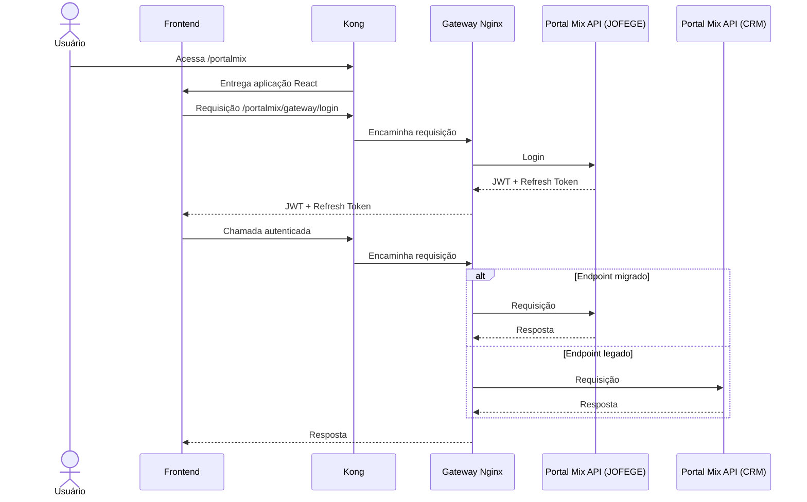

## Visão Geral

O Portal Mix é um portal originalmente desenvolvido pela CRM e atualmente em processo de reestruturação pela JOFEGE. O objetivo principal é corrigir problemas de segurança identificados na solução existente e transformar o projeto em uma aplicação interna, mantendo a continuidade operacional durante a transição.

A estratégia adotada prevê uma migração gradual, permitindo a coexistência entre componentes legados e novos por meio de mecanismos que garantem retrocompatibilidade.

---

## Objetivos da Reestruturação

- Corrigir vulnerabilidades e limitações presentes na solução original.
- Internalizar o desenvolvimento e manutenção da plataforma.
- Permitir evolução incremental da aplicação sem interrupção dos serviços.
- Garantir compatibilidade entre os componentes legados e os novos componentes.
- Estabelecer uma arquitetura preparada para as próximas ondas de migração.

---

## Escopo da Primeira Onda

A primeira onda da reestruturação é focada em autenticação e autorização dos usuários.

Durante esta etapa, as duas implementações da Portal Mix API coexistem:

- **Portal Mix API (CRM)**: implementação legada desenvolvida em Express.
- **Portal Mix API (JOFEGE)**: nova implementação desenvolvida em Java Spring 17.

O objetivo desta fase é introduzir a nova camada de autenticação mantendo compatibilidade com a API legada e permitindo um rollout gradual das funcionalidades.

---

## Arquitetura

Toda a infraestrutura da aplicação é executada em um cluster Kubernetes interno.

Os componentes envolvidos são:

### Kong

Responsável por ser o ponto de entrada da aplicação.

Atualmente, sua responsabilidade é:

- Exposição das rotas da aplicação.
- Aplicação de políticas de rate limiting.

Rotas expostas:

- `/portalmix` → Frontend React.
- `/portalmix/gateway` → Gateway Nginx.
- `/portalmix/v1` → API CRM
- `/portalmix/v2` → API JFG

---

### Frontend

Aplicação desenvolvida em React.

O frontend é acessado através do Kong e toda comunicação com o backend ocorre por meio do Gateway Nginx.

---

### Gateway Nginx

Responsável pelo roteamento das requisições para as APIs.

As regras de roteamento são baseadas em reescrita arbitrária de URLs (path transformation).

Novos endpoints são adicionados por meio da configuração do Nginx, permitindo direcionar requisições para a implementação apropriada sem impactar o frontend.

---

### Portal Mix API (JOFEGE)

Nova implementação desenvolvida em Java Spring 17.

Responsabilidades atuais:

- Autenticação dos usuários.
- Emissão de tokens JWT.
- Emissão de refresh tokens.

O Gateway Nginx está configurado para direcionar o fluxo de autenticação para esta API.

---

### Portal Mix API (CRM)

Implementação legada desenvolvida em Express.

Responsabilidades atuais:

- Autorização dos usuários.
- Atendimento dos endpoints ainda não migrados.

Durante o processo de rollout, esta API permanece em operação e continua validando os tokens JWT emitidos pela nova implementação.

---

## Comunicação entre os Componentes

Todos os componentes estão provisionados em Kubernetes:

- Frontend React.
- Gateway Nginx.
- Portal Mix API (CRM).
- Portal Mix API (JOFEGE).

A comunicação entre o Gateway Nginx e as APIs ocorre internamente utilizando os nomes dos serviços e suas respectivas portas internas do cluster Kubernetes (porta 8080).

---

## Estratégia de Compatibilidade

A migração é realizada de forma incremental.

O Gateway Nginx atua como camada de abstração entre o frontend e os serviços, permitindo:

- Convivência entre APIs legadas e novas.
- Migração gradual dos endpoints.
- Alterações transparentes para o frontend.
- Redução dos riscos associados ao processo de transição.

Os endpoints implementados na nova API são configurados no Gateway por meio das regras de path transformation, enquanto os endpoints ainda não migrados continuam sendo encaminhados para a implementação legada.

---

## Fluxo de Autenticação

1. O usuário acessa o Portal Mix através do frontend React.
2. O frontend envia a requisição para o endpoint exposto pelo Gateway.
3. O Gateway encaminha a requisição para a Portal Mix API (JOFEGE).
4. A autenticação é realizada pela nova API.
5. Em caso de sucesso, são gerados:
   - Access Token JWT.
   - Refresh Token.
6. O frontend utiliza o JWT nas chamadas subsequentes.
7. Tanto a Portal Mix API (JOFEGE) quanto a Portal Mix API (CRM) são capazes de validar o token emitido, garantindo retrocompatibilidade durante o rollout.

---

## Diagrama de Sequência

