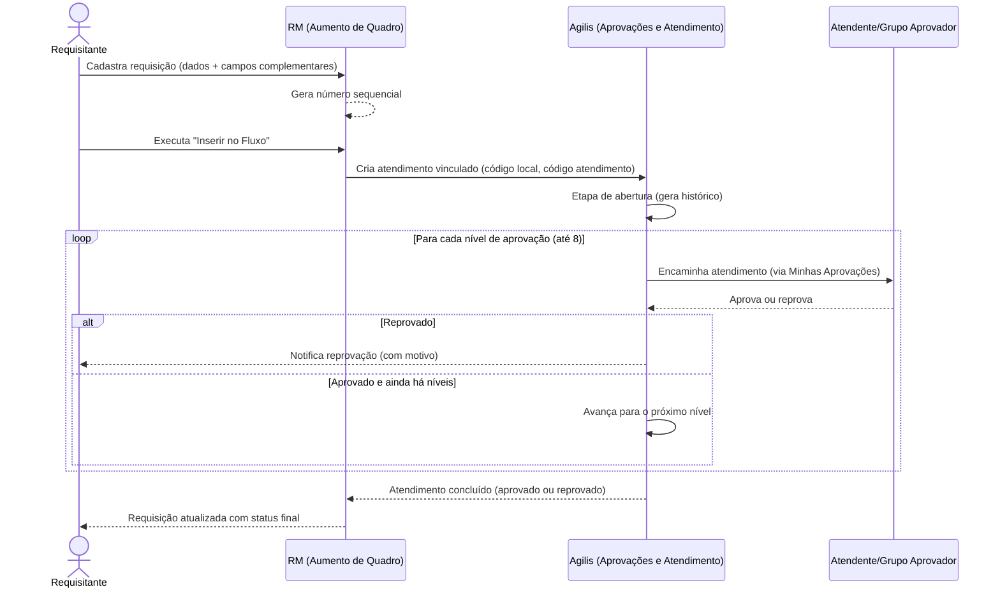

## Resumo da reunião

Reunião técnica com o time TOTVS para entender como funciona, dentro do RM, o processo de **Aumento de Quadro** e como ele se vincula ao **Minhas Aprovações**. O objetivo era esclarecer o que a documentação da TOTVS não deixava claro: quais serviços/APIs consumir, como o cadastro da requisição se conecta ao fluxo de aprovação (Agilis) e quais tabelas guardam esse vínculo.

A reunião foi conduzida por **Nicholas Melo** (desenvolvedor TOTVS), com apoio de **Bruna Rezende** (consultora TOTVS, parte funcional de RH) e participação de **Igor Monte** pelo lado JOFEGE. Lucas Camilo Dutra não conseguiu participar; a call foi gravada para o restante do time.

## Objetivo

Registrar o funcionamento técnico do cadastro de requisições no RM, o processo de envio ao fluxo de aprovação (Agilis), os campos e tabelas envolvidos, as APIs disponíveis para consumo e as limitações identificadas — servindo de base técnica complementar à [especificação funcional](/prh_levantamento-reuniao) e ao [projeto](/prh_portal-de-requisicao).

---

# Cadastro da requisição no RM

## 1. Regra de acesso — requisitante precisa de chapa

A requisição só pode ser aberta por um colaborador com **chapa** (PFUNC) cadastrada no RM. Como a maioria dos gestores solicitantes é tratada como pessoa **externa/PJ** no sistema, eles não conseguem abrir a requisição diretamente — daí a necessidade de um requisitante técnico interno (RH Central) e de um campo complementar para registrar o requisitante real. Esse ponto confirma e reforça a regra já registrada na [especificação funcional (seção 6.1)](/prh_levantamento-reuniao).

## 2. Campos padrão do cadastro (tela "Aumento de Quadro")

No RM, o cadastro fica no módulo **Planejamento e Captação → Requisições → Aumento de Quadro**. Os campos observados na tela:

| Campo | Observação |
| :-- | :-- |
| Número sequencial | Auto-incremento por tipo de requisição |
| Requisitante | Vem do cadastro de funcionários (precisa ter chapa) |
| Data de previsão | Data desejada de preenchimento da vaga |
| Quantidade de vagas solicitadas | — |
| Justificativa | Campo texto |
| Filial | Local de destino da vaga |
| Seção | Setor/departamento de destino |
| Função | Cargo da vaga |
| Salário | Não obrigatório; pode ser preenchido conforme regra de negócio |

## 3. Campos complementares

Como os campos complementares do RM têm limitações (não amarram tão facilmente em tabelas quanto um campo de metadados), a maioria foi cadastrada como **texto livre**. Exceção: **Tipo de Contratação**, que usa uma tabela dinâmica com opções pré-definidas.

| Campo complementar | Tipo | Observação |
| :-- | :-- | :-- |
| Centro de Custo | Texto | Não é possível amarrar em tabela; risco de erro de digitação |
| Solicitante da Requisição | Texto | É o requisitante **real** (gestor/PJ), diferente do requisitante técnico usado no cadastro |
| Responsável da Área | Texto | — |
| Requisitos da Vaga | Texto | — |
| Tipo de Contratação | Tabela dinâmica (lookup) | Único campo complementar amarrado a uma tabela |

**Definição futura combinada em reunião:** enquanto o Fluig não estiver acoplado, esses campos continuam como texto livre, preenchidos pelo portal. Quando o Fluig entrar, a ideia é amarrar essas informações em tabelas para ganhar segurança e assertividade (ex.: vincular pelo código externo do funcionário em vez de texto livre) — ponto levantado por Igor e confirmado por Bruna como evolução necessária.

---

# Fluxo técnico: do cadastro ao Agilis

## 1. Passo a passo

```text
1. Cadastrar requisição (Aumento de Quadro) no RM
   → gera identificador sequencial (auto-incremento)

2. Executar processo "Inserir no Fluxo"
   → usa o identificador gerado no passo 1
   → dispara a requisição para o Agilis (TOTVS Aprovações e Atendimento)

3. A partir daqui, todo o andamento ocorre dentro do Agilis / Minhas Aprovações
   → o RM só recebe o resultado quando o atendimento é finalizado
     (aprovado ou reprovado em definitivo)
```

## 2. Diagrama do fluxo



## 3. Níveis de aprovação no Agilis

- Existem **8 níveis pré-cadastrados** por modelo, pois cada seção pode ter um número diferente de níveis reais (uma seção usa 1 nível, outra usa 3, outra usa 5, e assim por diante) — o restante fica ocioso/não utilizado.
- Cada etapa tem uma **fórmula** que define se aquele nível deve ou não ser considerado para a requisição/seção em questão.
- Se todos os níveis aplicáveis forem aprovados, o atendimento vai para **"aguardando conclusão do requisitante"**.
- Se qualquer nível reprovar, o atendimento é travado, marcado como **reprovado** e o solicitante é notificado (o Agilis exige informar o motivo da reprovação).
- Cada nível pode apontar para um **atendente específico** ou para um **grupo de aprovação**:
  - **Atendente único**: o atendimento fica sob a responsabilidade direta dessa pessoa.
  - **Grupo com rodízio**: o Agilis distribui automaticamente para quem tem menos atendimentos pendentes no grupo.
  - **Grupo com fila**: o atendimento fica disponível para o grupo até alguém se apropriar dele.

### Tela observada — Modelo de Aprovações de Requisição

Módulo **Gestão → Modelo de Aprovações de Requisição**. O grid principal lista modelos por **Coligada** e **Seção**, com uma coluna booleana para cada tipo de requisição que aquele modelo atende. No exemplo mostrado na call, os tipos de requisição já configurados no ambiente de homologação eram:

- Aumento de Quadro
- Substituição
- Treinamento
- Abertura de Turmas
- Alteração de Dados Funcionais

> Esses cinco tipos são os que já existem configurados no RM de homologação — importante atualizar a lista de tipos futuros do portal (Fase 2) com base nesses nomes reais, em vez dos nomes hipotéticos usados na especificação inicial (ver seção de complementos abaixo).

Cada modelo, ao ser expandido, mostra o painel **Níveis de Aprovação**, com colunas: Modelo, Coligada, Ordem de Aprovação, Nível de Aprovação, Descrição do Nível, **Código do Atendente Aprovador** e **Grupo de Aprovação**. No exemplo demonstrado, o modelo tinha 5 níveis ativos: os quatro primeiros com atendente individual (códigos 715, 5, 717, 718) e o quinto direcionado ao grupo 46 ("Presidência").

### Tela observada — Avançar etapa (Agilis / Meus Atendimentos)

Módulo **Meus Atendimentos → Atendimentos**, ação **Avançar etapa**. Essa é a tela manual equivalente ao que a API `Ticket Step Forward` faz de forma programática: ela pede a **condição de conclusão da etapa atual** e o **motivo** do repasse, e tem a opção de marcar "atendente destino será o novo responsável pelo contato". No exemplo, o atendimento `1-1-35443` estava vinculado ao assunto `AumentoDeQuadro`.

## 4. Validação na abertura do fluxo

Ao inserir no fluxo, o RM valida:

1. Se existe um **modelo de aprovação cadastrado** para aquela seção.
2. Se esse modelo está **ativo**.
3. Se o modelo cadastrado cobre o **tipo de requisição** em questão (ex.: Aumento de Quadro).

Se qualquer uma dessas validações falhar, o processo retorna uma **exceção** — regra de negócio importante para o tratamento de erro no portal (mapear esse tipo de falha e exibir mensagem clara ao usuário, como já previsto em RF07/US01 da especificação).

---

# Tabelas de rastreabilidade (VREC)

Cada tipo de requisição tem sua própria tabela, sempre com o prefixo **VREC**:

- `VREC_AUMENTO_QUADRO`
- `VREC_SUBSTITUICAO`
- (e assim por diante, uma tabela por tipo)

Colunas **padrão**, presentes em praticamente todas as tabelas VREC:

- Requisitante
- Chapa
- Código Ligado
- Código Local
- Código de Atendimento

Essas três últimas colunas (**código ligado, código local e código de atendimento**) só são preenchidas **depois** que a requisição é inserida no fluxo — antes disso ficam vazias, pois é o momento em que o RM cria o vínculo com a tabela base de atendimento do Agilis.

> **Atenção para a Fase 2:** nem todos os tipos de requisição têm as mesmas colunas. Por exemplo, `Filial` pode não existir na tabela de Substituição, e `Seção` não existe em todos os tipos. Ao desenvolver a integração com outros tipos de requisição, **não assumir o mesmo schema do Aumento de Quadro** — validar a tabela VREC específica de cada tipo antes de implementar.

---

# APIs e limitações identificadas

## 1. API de Tickets da TOTVS

A API pública de Tickets (usada como referência) não é exclusiva para construção/obras — ela atende fluxos de **qualquer natureza** processados no Agilis, apesar de a TOTVS categorizá-la como "Construção e Projetos" no Swagger público.

Operações disponíveis: incluir atendimento, recuperar atendimento, atualizar atendimento, excluir, listar detalhes, atualizar detalhes.

A JOFEGE já mascarou **três APIs de Tickets da TOTVS em uma API própria**, cada uma com sua responsabilidade, para facilitar o consumo (ver [Swagger da API TOTVS interna](http://10.10.1.40:8051/api/swagger/ui/index), listado no projeto).

## 2. Avanço de etapa — `Ticket Step Forward`

Existe uma API separada e específica para avançar etapas de atendimento: **Ticket Step Forward**. É essa API que substitui, de forma programática, a ação manual "Avançar etapa" descrita acima.

## 3. Limitação confirmada — execução de processos ainda depende do SOAP

**Ponto crítico levantado nesta reunião:** até o momento, a API REST da TOTVS **não executa processos** (ex.: o processo "Inserir no Fluxo"). Processos como esse continuam dependendo do **serviço SOAP (TBC)**. Isso impacta diretamente a arquitetura da ACL, que precisará suportar chamadas SOAP para esse tipo de operação enquanto a TOTVS não migrar esses processos para REST.

Alternativa discutida para processos que não existam na nova arquitetura: implementar o processo via **fórmula visual** e chamar essa fórmula a partir da API, quando aplicável.

---

# Ambiente de testes

- Ambiente usado pela TOTVS na demonstração: **homologação**, com base de dados de **27/01/2026**.
- A base de produção não foi usada para os testes iniciais porque qualquer ajuste de metadados (criar/deletar coluna) exige parar o serviço — processo considerado muito custoso para uma fase de validação. A estratégia combinada foi validar o fluxo ponta a ponta em homologação antes de migrar para produção.
- Ação combinada: Igor solicitou casos de teste de **atendimentos pendentes** nessa base, para validar se a listagem via API retorna os dados esperados. Caso não retorne, a estratégia de consumo pode precisar ser revista.

---

# Pendências

- Confirmar se a API de Tickets consegue listar atendimentos pendentes de forma confiável na base de homologação (27/01/2026) — Igor vai testar.
- Definir se a porta alternativa de acesso à base de homologação (mencionada como possivelmente distinta de `8051`) será necessária.
- Detalhar, por tipo de requisição, quais colunas a tabela VREC correspondente possui (ver observação acima).
- Avaliar como o portal vai identificar, dentro do Minhas Aprovações, **qual o tipo de requisição** de cada atendimento pendente (ideia discutida: taguear cada tipo de solicitação e filtrar/gravar essa tag na tabela de vínculo do portal).

---

# Complementos à especificação funcional

A partir do que foi confirmado nesta call, os seguintes pontos da [especificação funcional](/prh_levantamento-reuniao) merecem atualização em uma futura revisão do documento:

- A seção 4.2 lista como possíveis tipos futuros "Desligamento \+ Substituição", "Transferência" e "Alteração de dados funcionais". O ambiente real de homologação já tem cadastrados: **Aumento de Quadro, Substituição, Treinamento, Abertura de Turmas e Alteração de Dados Funcionais** — vale alinhar a nomenclatura da Fase 2 com esses tipos reais.
- A seção 10.3 (Camada anti-corrupção) deve prever explicitamente suporte a **SOAP** para o processo "Inserir no Fluxo" e outros processos ainda não migrados para REST, além do consumo REST já previsto.
- A entidade `Solicitação` (seção 11.1) pode incorporar os campos `codigoLigado`, `codigoLocal` e `codigoAtendimento`, que é como o RM nomeia, na tabela VREC, os identificadores preenchidos após o "Inserir no Fluxo" — hoje a especificação usa os nomes genéricos `idRmAtendimento`/`idFluxoAprovacao`.

---

# Responsáveis e participantes

## TOTVS

- **Nicholas Melo** — desenvolvedor, apresentou o fluxo técnico
- **Bruna Rezende** — consultora de RH, apoio funcional e nos campos complementares

## JOFEGE

- **Igor Monte** — coordenador de desenvolvimento, conduziu a call pelo lado JOFEGE

Lucas Camilo Dutra e demais integrantes do time de desenvolvimento não participaram desta call; a gravação foi feita para consulta posterior pelo time.